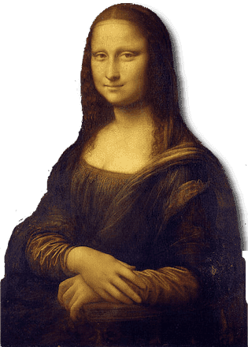
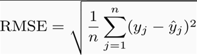
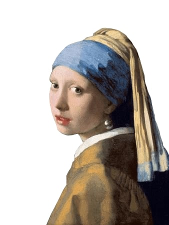
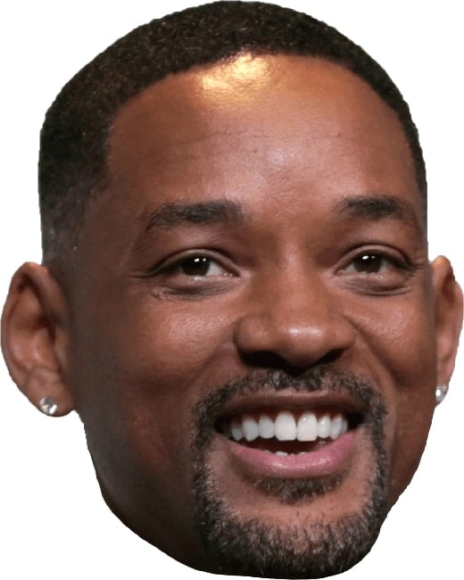
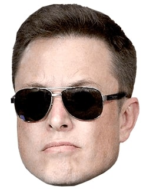
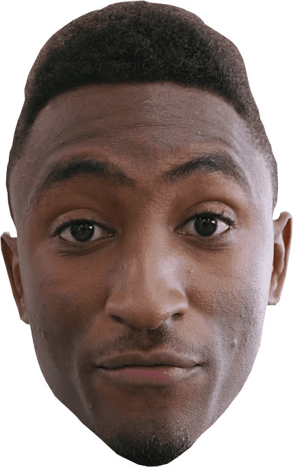
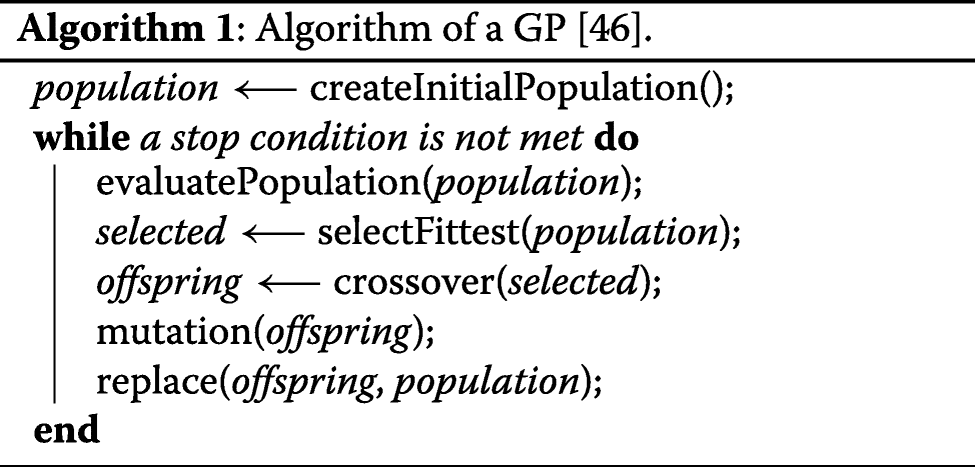
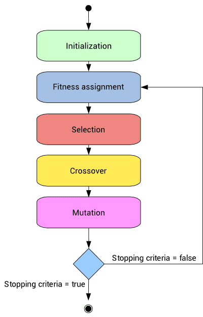

# Genetic Algorithm for Self-Referential Image Approximation

  
  
  
Mona Lisa after 120'000 generations approximated with 260 individuals.

## Introduction
One approach to solve the image matching problem is with some *stochastic optimization* approach, in which the search for the optimal solution involves randomness in some constructive way. If S denotes the (finite) set of all possible solutions, the task we consider is to maximize or minimize the *objective function* . In the case of maximization, on which we focus here, the problem is to find a *configuration*  which satisfies

## Genetic Algorithm
Genetic algorithms operate on a set of individuals (solutions) which form a population for a determined generation, then either two individuals are selected and combined in a crossover operation or each individual is mutated.

We might refer to an approximate solution as a "candidate", or the solution's "DNA".

A genetic algorithm tries to solve the image matching problem by starting with a random population of 260 sets of DNA consisting in form of genes with a length of 5. A fitness function is used to identify the best and worst DNA.
To get a measure of how similar two images are, we calculate the root-mean-square (RMS) value of the difference between the images. If the images are exactly identical, this value is zero.

Crossover and mutations are randomly performed in order to generate new solutions.
Then, based on a selection criterion, the strongest individuals (those with the best value of a performance metric) survive and remain for the next generation. 

The process is repeated until some stopping conditions are fulfilled.
In order to perform the selection of the individuals in the GA a fitness value needs to be defined. This fitness value measures the quality of the individuals and enables them to be compared.

## Procedure

  
  
Computation time: 43 min @ Intel i9 9900k

  
  
Computation time: 59 min @ Intel i9 9900k

## Results

Input Face             |   ~100'000 generations | Fitness Score
:-------------------------:|:-------------------------:|:-------------------------:
 |   | Mona Lisa: **93.071%**
 |  | Girl with a Pearl Earring: **84.095%**
 |   | Will Smith: **85.863%**
 |  | Elon Musk: **81.632%**
 |  | Rowan Atkinson: **89.364%**
 |  | Marques Brownlee: **90.349%**

## Misc

Pseudo Code             |   Flow chart
:-------------------------:|:-------------------------:
  |  

## License

**MIT License**

[Muriz Serifovic](https://muriz.me)